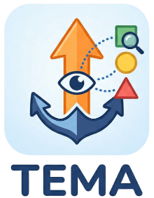
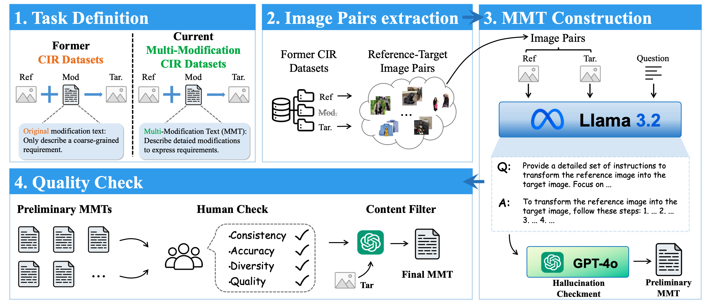
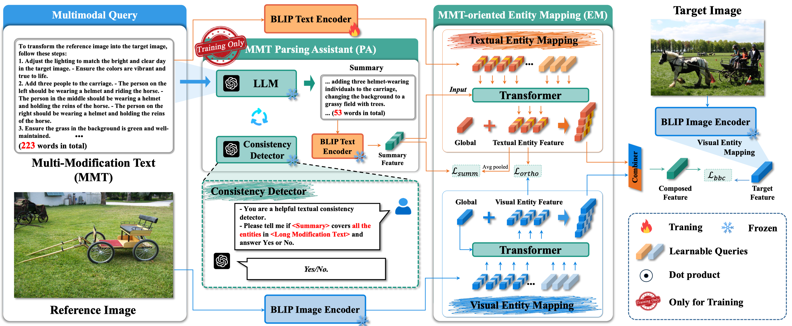
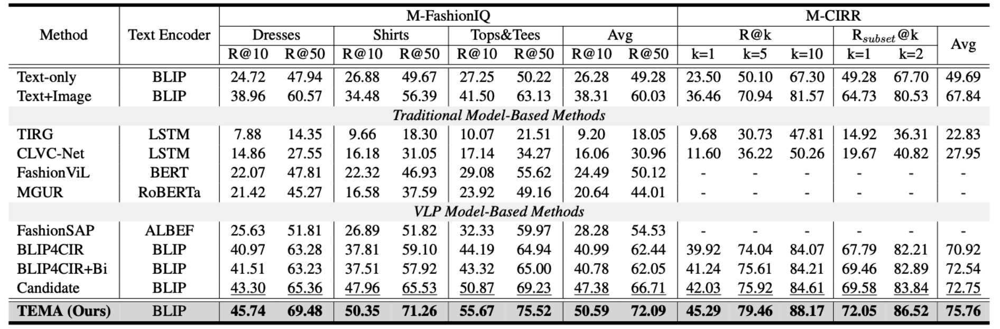

  

  <h1 align="center">[ACL 2026] ⚓ TEMA: Anchor the Image, Follow the Text for Multi-Modification Composed Image Retrieval</h1>
  

  <a target="_blank" href="https://lee-zixu.github.io/">Zixu&#160;Li</a>1,
    <a target="_blank" href="https://faculty.sdu.edu.cn/huyupeng1/zh_CN/index.htm">Yupeng&#160;Hu</a>1&#9993,
    <a target="_blank" href="https://zhihfu.github.io/">Zhiheng&#160;Fu</a>1,
  <a target="_blank" href="https://zivchen-ty.github.io/">Zhiwei&#160;Chen</a>1,
   <a target="_blank" href="https://liyongqi67.github.io/">Yongqi&#160;Li</a>2,
  <a target="_blank" href="https://liqiangnie.github.io">Liqiang&#160;Nie</a>3
  

  1School of Software, Shandong University &#160&#160&#160   
     2Department of Computing, Hong Kong Polytechnic University &#160&#160&#160  
  3School of Computer Science and Technology, Harbin Institute of Technology (Shenzhen) &#160&#160&#160 
   
  &#9993&#160;Corresponding author&#160;&#160;
   
    
  

      
    <!--  -->
    
    
    
    
  

  

    <b>Official Repository:</b> This is an open-source implementation of the paper "TEMA: Anchor the Image, Follow the Text for Multi-Modification Composed Image Retrieval".
  

## 📌 Introduction

**TEMA** (Text-oriented Entity Mapping Architecture) is the first Composed Image Retrieval (CIR) framework designed explicitly for multi-modification scenarios while seamlessly accommodating simple modifications. Prevailing CIR setups rely on simple modification texts, which typically cover only a limited range of salient changes. This induces two critical limitations highly relevant to practical applications: **Insufficient Entity Coverage** and **Clause-Entity Misalignment**. 

To bring CIR closer to real-world use, we introduce two instruction-rich multi-modification datasets: **M-FashionIQ** and **M-CIRR**. Through MMT parsing and entity mapping, TEMA actively perceives and structurally models these complex modifications to achieve precise retrieval.

[⬆ Back to top](#top)

## 📢 News
- **[2026.04.07]** 🔥 TEMA was accepted by ACL 2026!
- **[2026.04.06]** 🚀 Released all training and evaluation codes.

[⬆ Back to top](#top)

## ✨ Key Contributions

  - 📊 **New Benchmarks (M-FashionIQ & M-CIRR)**: We construct two instruction-intensive datasets that replace short, simplistic texts with Multi-Modification Texts (MMT). These are generated by MLLM and verified by human annotators to explicitly present constraint structures with multiple entities and clauses.
  - 🧠 **MMT Parsing Assistant (PA)**: Designed to address "Insufficient Entity Coverage". It utilizes an LLM-based text summarizer and a Consistency Detector during training to enhance the exposure and coverage of modified entities through summarization and checks.
  - 🔗 **MMT-oriented Entity Mapping (EM)**: Tackles the "Clause-Entity Misalignment" issue. It introduces learnable queries to consolidate multiple clauses of the same entity on the text side and align them with corresponding visual entities on the image side, stabilizing "one-to-many" relationship modeling.
  - 🏆 **Superior Performance**: Extensive experiments on four benchmark datasets demonstrate TEMA's superiority in both original and multi-modification scenarios.

[⬆ Back to top](#top)

## 🏗️ Architecture
### 1. Data Generation Pipeline

  
  <figcaption><strong>Figure 1.</strong> Pipeline of the construction of our proposed multi-modification CIR datasets.</figcaption>

### 2. TEMA Framework

  
  <figcaption><strong>Figure 2.</strong> The overall framework of TEMA, comprising the MMT Parsing Assistant (PA) utilized only during training, and the MMT-oriented Entity Mapping (EM) module for multimodal alignment.</figcaption>

[⬆ Back to top](#top)

---
## 🚀 Experimental Results

  
  <figcaption><strong>Figure 3.</strong> Performance comparison on M-FashionIQ and M-CIRR relative to R@K(%). The overall best results are in bold, while best results over baselines are underlined. The Avg metric in M-CIRR denotes (R@5 + Rsubset@1) / 2.</figcaption>

[⬆ Back to top](#top)

---

## Table of Contents

- [Introduction](#-introduction)
- [Key Contributions](#-key-contributions)
- [Architecture](#-architecture)
- [Experimental Results](#-experimental-results)
- [Installation](#-installation)
- [Data Preparation](#-data-preparation)
- [Quick Start](#-quick-start)
- [Acknowledgement](#-acknowledgement)
- [Citation](#️-citation)

---

## 📦 Installation

**1. Clone the repository**

~~~bash
git clone https://github.com/lee-zixu/ACL26-TEMA
cd TEMA
~~~

**2. Setup Python Environment**

The code is evaluated on **Python 3.10.8** and **PyTorch 2.5.1** using an **NVIDIA A40 48G** GPU. We recommend using Anaconda to create an isolated virtual environment:

~~~bash
conda create -n tema python=3.10.8
conda activate tema

# Install PyTorch
pip install torch==2.5.1 torchvision torchaudio --index-url https://download.pytorch.org/whl/cu121

# Install core dependencies
pip install transformers==4.25.0
~~~

[⬆ Back to top](#top)

---

## 📂 Data Preparation

We evaluated our framework on our newly proposed **M-FashionIQ** and **M-CIRR** datasets. Please prepare the data by following the steps below:

### 1. Fashion-domain Dataset: M-FashionIQ

First, download the FashionIQ dataset following the instructions in the [official repository](https://github.com/XiaoxiaoGuo/fashion-iq). After downloading, to obtain our proposed M-FashionIQ dataset, replace the `captions` folder with our provided `mmt_captions`. 

<b>Ensure the folder structure matches the following:</b>

~~~text
├── M-FashionIQ
│   ├── mmt_captions
│   │   ├── cap.dress.[train | val].mmt.json
│   │   ├── cap.toptee.[train | val].mmt.json
│   │   ├── cap.shirt.[train | val].mmt.json
│   ├── image_splits
│   │   ├── split.dress.[train | val | test].json
│   │   ├── split.toptee.[train | val | test].json
│   │   ├── split.shirt.[train | val | test].json
│   ├── dress
│   │   ├── [B000ALGQSY.jpg | B000AY2892.jpg | B000AYI3L4.jpg |...]
│   ├── shirt
│   │   ├── [B00006M009.jpg | B00006M00B.jpg | B00006M6IH.jpg | ...]
│   ├── toptee
│   │   ├── [B0000DZQD6.jpg | B000A33FTU.jpg | B000AS2OVA.jpg | ...]
~~~

### 2. Open-domain Dataset: M-CIRR

First, download the CIRR dataset following the instructions in the [official repository](https://github.com/Cuberick-Orion/CIRR). After downloading, to obtain our proposed M-CIRR dataset, replace the `captions` folder with our provided `mmt_captions`.

<b>Ensure the folder structure matches the following:</b>

~~~text
├── M-CIRR
│   ├── train
│   │   ├── [0 | 1 | 2 | ...]
│   │   │   ├── [train-10108-0-img0.png | train-10108-0-img1.png | ...]
│   ├── dev
│   │   ├── [dev-0-0-img0.png | dev-0-0-img1.png | ...]
│   ├── test1
│   │   ├── [test1-0-0-img0.png | test1-0-0-img1.png | ...]
│   ├── mcirr
│   │   ├── mmt_captions
│   │   │   ├── cap.rc2.[train | val | test1].mmt.json
│   │   ├── image_splits
│   │   │   ├── split.rc2.[train | val | test1].json
~~~

[⬆ Back to top](#top)

---

## 🚀 Quick Start

### Training Phase

To start training TEMA on your prepared datasets, execute the following command:

~~~bash
python3 train.py
~~~

[⬆ Back to top](#top)

---

## 🤝 Acknowledgement

Our implementation is based on the [LAVIS](https://github.com/chiangsonw/cala?tab=readme-ov-file) framework. We express our sincere gratitude to their open-source contributions!

[⬆ Back to top](#top)

---

## 🔗 Related Projects

*Ecosystem & Other Works from our Team*

<table style="width:100%; border:none; text-align:center; background-color:transparent;">
<tr style="border:none;">
 <td style="width:30%; border:none; vertical-align:top; padding-top:30px;">
       
      <b>ConeSep (CVPR'26)</b> 
      
        <a href="https://lee-zixu.github.io/ConeSep.github.io/" target="_blank">Web</a> | 
        <a href="https://github.com/lee-zixu/ConeSep" target="_blank">Code</a> | 
        <!-- <a href="https://ojs.aaai.org/index.php/AAAI/article/view/37608" target="_blank">Paper</a> -->
      
    </td>
     <td style="width:30%; border:none; vertical-align:top; padding-top:30px;">
       
      <b>Air-Know (CVPR'26)</b> 
      
        <a href="https://zhihfu.github.io/Air-Know.github.io/" target="_blank">Web</a> | 
        <a href="https://github.com/zhihfu/Air-Know" target="_blank">Code</a> | 
        <!-- <a href="https://ojs.aaai.org/index.php/AAAI/article/view/37608" target="_blank">Paper</a> -->
      
    </td>
     <td style="width:30%; border:none; vertical-align:top; padding-top:30px;">
       
      <b>ReTrack (AAAI'26)</b> 
      
        <a href="https://lee-zixu.github.io/ReTrack.github.io/" target="_blank">Web</a> | 
        <a href="https://github.com/Lee-zixu/ReTrack" target="_blank">Code</a> | 
        <a href="https://ojs.aaai.org/index.php/AAAI/article/view/39507" target="_blank">Paper</a>
      
    </td>
   </tr>
  <tr style="border:none;">
    <td style="width:30%; border:none; vertical-align:top; padding-top:30px;">
       
      <b>INTENT (AAAI'26)</b> 
      
        <a href="https://zivchen-ty.github.io/INTENT.github.io/" target="_blank">Web</a> | 
        <a href="https://github.com/ZivChen-Ty/INTENT" target="_blank">Code</a> | 
        <a href="https://ojs.aaai.org/index.php/AAAI/article/view/39181" target="_blank">Paper</a>
      
    </td>  
    <td style="width:30%; border:none; vertical-align:top; padding-top:30px;">
       
      <b>HUD (ACM MM'25)</b> 
      
        <a href="https://zivchen-ty.github.io/HUD.github.io/" target="_blank">Web</a> | 
        <a href="https://github.com/ZivChen-Ty/HUD" target="_blank">Code</a> | 
        <a href="https://dl.acm.org/doi/10.1145/3746027.3755445" target="_blank">Paper</a>
      
    </td>
    <td style="width:30%; border:none; vertical-align:top; padding-top:30px;">
       
      <b>OFFSET (ACM MM'25)</b> 
      
        <a href="https://zivchen-ty.github.io/OFFSET.github.io/" target="_blank">Web</a> | 
        <a href="https://github.com/ZivChen-Ty/OFFSET" target="_blank">Code</a> | 
        <a href="https://dl.acm.org/doi/10.1145/3746027.3755366" target="_blank">Paper</a>
      
    </td>
     </tr>
  <tr style="border:none;">
    <td style="width:30%; border:none; vertical-align:top; padding-top:30px;">
       
      <b>ENCODER (AAAI'25)</b> 
      
        <a href="https://sdu-l.github.io/ENCODER.github.io/" target="_blank">Web</a> | 
        <a href="https://github.com/Lee-zixu/ENCODER" target="_blank">Code</a> | 
        <a href="https://ojs.aaai.org/index.php/AAAI/article/view/32541" target="_blank">Paper</a>
      
    </td>
    <td style="width:30%; border:none; vertical-align:top; padding-top:30px;">
       
      <b>HABIT (AAAI'26)</b> 
      
        <a href="https://lee-zixu.github.io/HABIT.github.io/" target="_blank">Web</a> | 
        <a href="https://github.com/Lee-zixu/HABIT" target="_blank">Code</a> | 
        <a href="https://ojs.aaai.org/index.php/AAAI/article/view/37608" target="_blank">Paper</a>
      
    </td>
  </tr>
</table>

## 📝 Citation

If you find our paper, the M-FashionIQ/M-CIRR datasets, or this codebase useful in your research, please consider citing our work:

~~~bibtex
@inproceedings{TEMA,
  title={TEMA: Anchor the Image, Follow the Text for Multi-Modification Composed Image Retrieval},
  author={Li, Zixu and Hu, Yupeng and Fu, Zhiheng and Chen, Zhiwei and Li, Yongqi and Nie, Liqiang},
  booktitle={Proceedings of the Association for Computational Linguistics (ACL)},
  year={2026}
}
~~~

[⬆ Back to top](#top)

## 🫡 Support & Contributing

We welcome all forms of contributions\! If you have any questions, ideas, or find a bug, please feel free to:

  - Open an [Issue](https://github.com/lee-zixu/ACL26-TEMA/issues) for discussions or bug reports.
  - Submit a [Pull Request](https://github.com/lee-zixu/ACL26-TEMA/pulls) to improve the codebase.

[⬆ Back to top](#top)

## 📄 License

This project is released under the terms of the [LICENSE](./LICENSE) file included in this repository.

  

  
  
  

  

